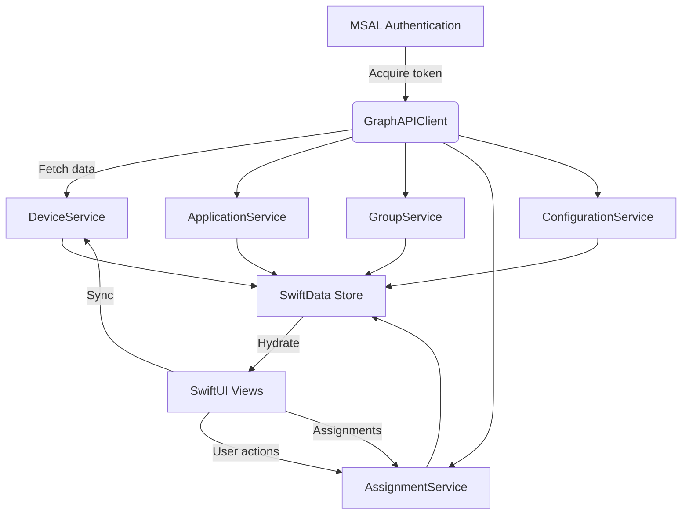

# Architecture

IntuneManager is a SwiftUI codebase targeting macOS. The app layers authentication, local persistence, and Microsoft Graph integrations to deliver a responsive experience that mirrors the Intune admin portal.

## High-level components

- **AuthManagerV2** orchestrates MSAL, caches tokens, and broadcasts authentication state to the UI.
- **GraphAPIClient** centralises HTTP calls, throttling, and Graph-specific error handling.
- **Services** (Device, Application, Group, Assignment, Configuration) fetch, normalise, and publish data as `ObservableObject`s.
- **SwiftData models** (`Device`, `Application`, `DeviceGroup`, `Assignment`, `CacheMetadata`) persist entities for offline access and quick reloads.
- **Feature modules** under `IntuneManager/Features` present domain-specific SwiftUI views powered by service data.

## Authentication flow

1. Setup stores client and tenant IDs in `CredentialManager`.
2. `AuthManagerV2.initializeMSAL()` configures MSAL with redirect URI and keychain group.
3. Signing in launches the Microsoft web experience with delegated Graph scopes.
4. Tokens are cached and refreshed proactively via timers.
5. Sign-out clears MSAL accounts, local caches, and resets the app state.

## Data access pattern

- Services call `GraphAPIClient` with strongly-typed request objects.
- Responses are decoded into SwiftData models and stored asynchronously.
- Views subscribe via `@StateObject` or `@EnvironmentObject` to receive live updates.
- Batch operations (assignments, device sync) use structured progress reporting to keep the UI responsive.

## Error handling

- Permission failures translate into `AppState.PermissionError`, showing actionable alerts with required scopes.
- Network errors bubble through `Logger.shared` and surface via status banners.
- Failed assignment batches retry with exponential backoff up to three attempts.

## macOS UI considerations

- Shared SwiftUI layout resides in unified views (`UnifiedContentView`, `UnifiedSidebarView`).
- AppKit integration (keyboard shortcuts, navigation styles, window commands) flows through helper abstractions in `PlatformCompatibility`.
- Feature views rely on `NavigationSplitView`, tables, and Command menu shortcuts to match macOS expectations.

## Extensibility points

- **Services** expose `forceRefresh` parameters to bypass caches and fetch fresh data when building new features.
- **AssignmentService.performBulkAssignment** accepts operations that can be extended to support additional intent types once Graph adds support.
- **ConfigurationService** handles settings catalog templates and import/export, providing groundwork for future compliance automation.

See [API & Performance](api-optimization.md) for more on batching, caching strategies, and Graph API usage.
